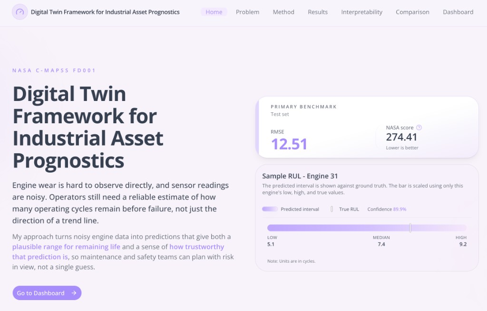
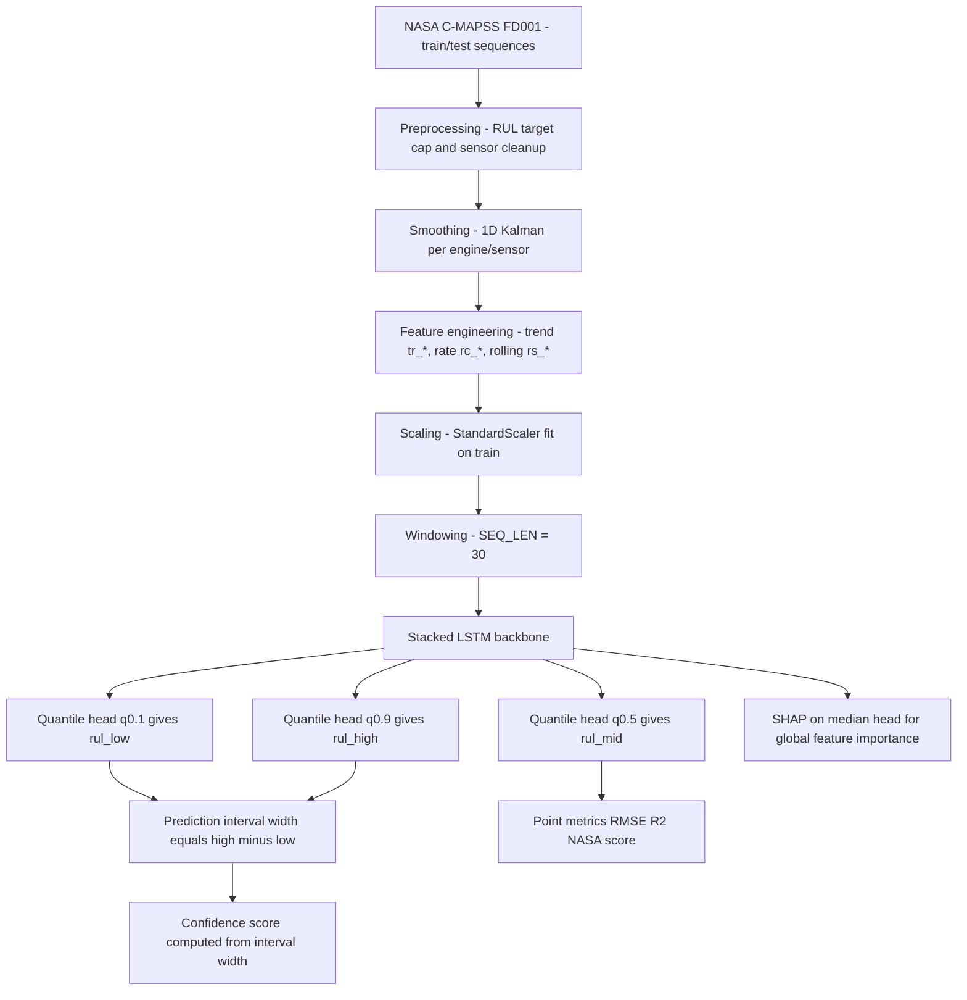

# Digital Twin Framework for Industrial Asset Prognostics

Data-driven prognostics pipeline for Remaining Useful Life (RUL) estimation on NASA C-MAPSS FD001, built around:

- sequence modeling with LSTM
- quantile regression for uncertainty intervals (low / median / high)
- confidence estimation from interval width
- SHAP-based interpretability for feature importance

## Live project

- **Dashboard (live):** [https://rul-dashboard-app.sarthakchandervanshi.uk/](https://rul-dashboard-app.sarthakchandervanshi.uk/)



## Project objective

Industrial assets degrade under noisy and non-stationary operating conditions. A single RUL number is often not enough for safe maintenance decisions.

This project estimates:

- a **central RUL prediction** (median)
- a **prediction interval** (lower and upper quantiles)
- a **confidence signal** derived from interval sharpness

The goal is to support risk-aware maintenance planning, not only point forecasting.

## Dataset

- **Benchmark:** NASA C-MAPSS FD001
- **Input:** multivariate engine sensor time series
- **Task:** estimate remaining cycles to failure

Core files are expected under `data/CMAPSSData/`:

- `train_FD001.txt`
- `test_FD001.txt`
- `RUL_FD001.txt`

## Method summary

1. **Preprocessing**
  - remove low-information columns
  - create capped RUL target
  - smooth sensor streams (Kalman filtering)
2. **Feature engineering**
  - trend (`tr_`*), rate-of-change (`rc_*`), rolling statistics (`rs_*`)
3. **Model**
  - stacked LSTM over sliding windows (`SEQ_LEN = 30`)
  - three quantile heads (0.1, 0.5, 0.9)
4. **Training**
  - quantile (pinball) loss
  - validation-based training controls
5. **Evaluation**
  - point metrics + asymmetric risk metric + interval quality
6. **Interpretability**
  - global SHAP on median head

## Pipeline and model architecture



Architecture notes:

- **Input tensor:** `(batch, 30, n_features)` with engineered features.
- **Core model:** stacked LSTM layers learn temporal degradation dynamics.
- **Output heads:** three quantile heads (`0.1, 0.5, 0.9`) provide uncertainty-aware RUL.
- **Training loss:** pinball (quantile) loss across all heads.
- **Decision-facing outputs:** low/median/high RUL, interval width, confidence, and SHAP explanations.

For narrative details, see:

- `artifacts/docs/problem.md`
- `artifacts/docs/method.md`
- `artifacts/docs/results.md`
- `artifacts/docs/literature.md`

## Current FD001 results (precomputed)

From `artifacts/data/metrics.json` (scope: `last_window_per_test_engine`, `n_engines = 100`):

- **RMSE:** `12.510066`
- **NASA_score:** `274.41338`
- **R2:** `0.902544`
- **Coverage:** `0.83`
- **Mean interval width:** `32.859956`
- **Within 10%:** `68.0`
- **Within 20%:** `88.0`

## Literature comparison (FD001)

The table below provides a practical comparison on FD001. Values from literature are taken from source-reported settings, so this should be read as a **reference comparison** rather than a perfectly controlled head-to-head benchmark.

| Rank | Model / source | NASA score (lower better) | RMSE (lower better) | Status | Link |
|---|---|---:|---:|---|---|
| 1 | Attention-LSTM (PHM Society) | 200.00 | 12.33 | SOTA | [Paper](https://papers.phmsociety.org/index.php/ijphm/article/download/4274/2620) |
| 2 | Quantile LSTM + SHAP (this project) | 274.41 | 12.51 | Proposed | [Live dashboard](https://rul-dashboard-app.sarthakchandervanshi.uk/) |
| 3 | CAE-LSTM (Scientific Reports) | 282.38 | 14.44 | SOTA | [Paper](https://www.nature.com/articles/s41598-025-09155-z) |
| 4 | Stacked LSTM (JOETEX) | 311.20 | 15.22 | Baseline | [Paper](https://shmpublisher.com/index.php/joetex/article/download/585/317/3730) |

## Key artifacts

- `artifacts/data/metrics.json` - aggregate performance and interval quality
- `artifacts/data/predictions.json` - per-engine low/mid/high, width, confidence, interval hit
- `artifacts/data/shap_global.json` - global SHAP ranking
- `artifacts/models/fd001/preprocess_config.json` - preprocessing metadata
- `notebooks/model/fd001/config.json` - model/training configuration
- `notebooks/model/fd001/weights.weights.h5` - trained model weights
- `dashboard/public/data/` - dashboard-ready static data payloads

## Repository structure

```text
.
|- artifacts/
|  |- data/
|  |- docs/
|  `- models/
|- dashboard/
|  `- public/data/
|- data/CMAPSSData/
|- notebooks/
|  |- fd001.ipynb
|  `- model/fd001/
|- pyproject.toml
|- requirements.txt
`- README.md
```

## Set up the project

Requires Python **3.12 or newer** (see `pyproject.toml`). Dependencies are listed in `pyproject.toml` (Poetry) and mirrored for pip in **`requirements.txt`**.

Pick Poetry or pip; both resolve the same direct dependencies.

### Option A — Poetry

```bash
poetry install
poetry shell
```

### Option B — pip and a virtual environment

```bash
python3.12 -m venv .venv
source .venv/bin/activate   # Windows: .venv\Scripts\activate
pip install --upgrade pip
pip install -r requirements.txt
```

### Dataset layout

Place the NASA C-MAPSS FD001 text files under `data/CMAPSSData/` (`train_FD001.txt`, `test_FD001.txt`, `RUL_FD001.txt`) before training or preprocessing steps in the notebook.

## How to run

1. **Complete setup** — follow [Set up the project](#set-up-the-project) and confirm the dataset files are present.
2. **Reproduce training and artifacts** — open `notebooks/fd001.ipynb` in Jupyter, VS Code, or Cursor with your chosen kernel/venv activated, then run all cells top to bottom. The notebook refreshes artifacts under `artifacts/data/`, writes model files under `notebooks/model/fd001/`, and can refresh dashboard JSON under `dashboard/public/data/` when those export cells are run.
3. **View the dashboard** — use the hosted app: [https://rul-dashboard-app.sarthakchandervanshi.uk/](https://rul-dashboard-app.sarthakchandervanshi.uk/). This repository stores the precomputed dashboard payloads (for example `dashboard/public/data/engine_series/` and `dashboard/public/data/shap_local/`) that back that experience; the interactive UI is deployed separately from this repo.

## Why intervals + SHAP

- **Intervals** make uncertainty explicit for maintenance decisions.
- **NASA score** emphasizes operationally costly late errors.
- **SHAP** validates that predictions rely on degradation dynamics (trend/change features), improving trust and explainability.

## License

MIT (see `LICENSE`).

## Author

Sarthak Chandervanshi